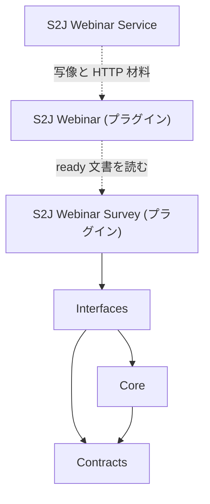

<!--
目的：「フォルダー構成、主要ファイル、技術スタック、責務」の明文化
-->

# S2J Webinar Survey Service - アーキテクチャー

本ドキュメントでは、本プロジェクトを **Composer パッケージとして実装するための指針** を定義します。

## 設計意図 (ゴール)

設問の検査・助言・下書き分解を、WordPress と Zoom とモデル HTTP から切り離し、PHPUnit だけで回帰できるようにします。

## 設計方針 (規約)

* FOP + Clean Coding を基本とします。Clean Architecture の定型分割は採用しない。
* コアは、純粋関数と不変レコードに閉じる。
* 表示文、HTTP、永続化は、ライブラリの外である。

## レイヤー構成

| 層 | 責務 | 非責務 |
| --- | --- | --- |
| Contracts | 文書・結果・候補の形 | 不足判定の本体 |
| Core | 検査、助言、依頼文、分解 | I/O、i18n 文言 |
| Interfaces | 公開関数の入口 | ドメイン規則の重複実装 |



## フォルダー構成 (想定)

```plaintext
s2j-webinar-survey-service/
├── README.md
├── LICENSE
├── composer.json
├── phpunit.xml
├── phpstan.neon
├── phpcs.xml.dist
├── package.json              # docs lint のみ
├── docs/                     # 確定仕様 (archive/ にイニシアチブ証跡)
├── docs_mod/                 # 改訂案・進行中証跡の起草用 (空でもよい)
├── coverage/                 # PHPUnit 生成物 (gitignore)
├── src/
│   ├── Contracts/            # 配列形状または不変レコード
│   ├── Core/
│   │   ├── Document.php      # 正規化・状態付与の入口補助
│   │   ├── Validate.php      # 不足コード
│   │   ├── Advise.php        # 助言コード
│   │   └── Draft.php         # 依頼文・分解
│   └── evaluate.php 等       # 公開関数 (evaluate / build_draft_prompt / parse_draft_response)
└── tests/
    ├── Unit/
    └── bootstrap.php
```

**公開面は名前空間関数の3つだけ**です。正本は [php_api_spec.md](./interfaces/php_api_spec.md) です。`Core\*.php` は内部実装であり、呼び出し側は直接使いません。Singleton やサービスロケータは使いません。

## 技術スタック

| 項目 | 方針 |
| --- | --- |
| PHP | v8.1以上 |
| テスト | PHPUnit (WordPress なし) |
| 静的解析 | PHPStan |
| スタイル | PHPCS (PSR-12を基本) |
| ドキュメント lint | `@s2j/docs-linter` / `npm run lint:docs` |
| 配布 | Packagist (`s2j/webinar-survey-service`) |

## プラグインとの境界

| 置き場 | 中身 |
| --- | --- |
| 本ライブラリ | 計算 |
| S2J Webinar Survey | 編集、保存、助言の日本語、コネクタ、上限のサイト設定 |
| S2J Webinar / webinar-service | Zoom 添付 HTTP と設問型写像 |

## 関連ドキュメント

* 原則: [principles.md](./principles.md)
* 公開面: [interfaces/php_api_spec.md](./interfaces/php_api_spec.md)
