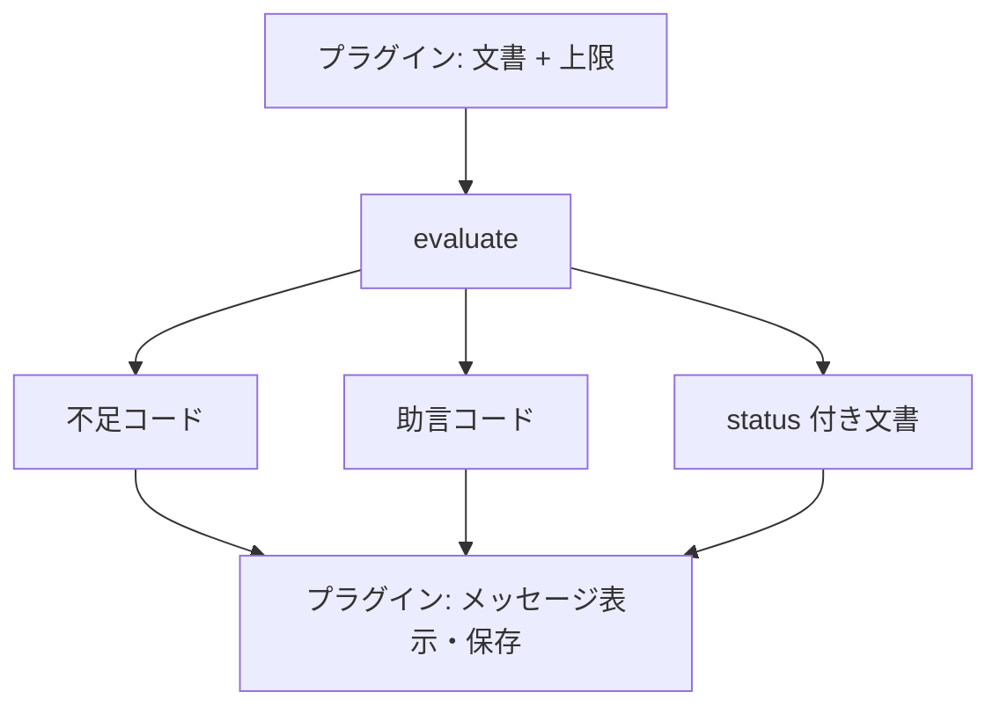
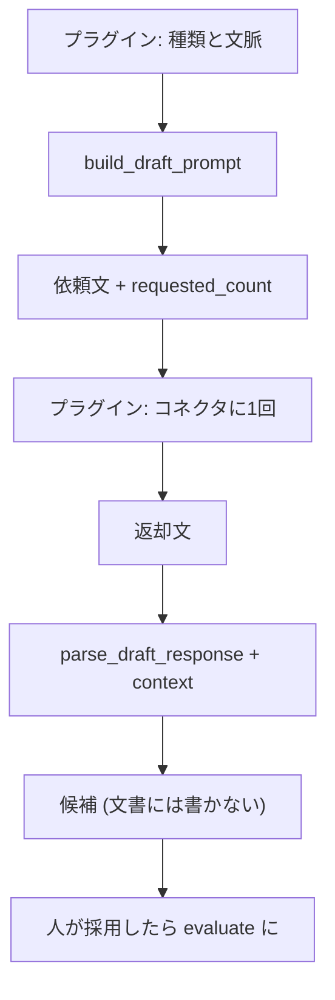

<!--
目的：「想定ユースケース、解決する課題、処理フロー」の明文化
-->

# S2J Webinar Survey Service - コンセプト

本ドキュメントは、本プロジェクトの **背景理解** を目的とします。
本ライブラリが「何を前提とし」「どのような場面で使われ」「何を解決し」「何を対象外とするか」を明確にします。

## 前提条件

* 運営者が、イベント編集画面でその回のアンケート設問を書く。
* 設問総数の上限は、サイト設定としてプラグインが渡し、ライブラリには埋め込まない。
* 下書きを頼む場合は、プラグインがサイトのコネクタに1回送り、返ってきた文だけを本ライブラリが分ける。
* Zoom への添付は、S2J Webinar が `ready` の文書だけを読む。写像と HTTP 材料は S2J Webinar Service である。

## 解決する課題

勤務先では Zoom Webinar のあとにアンケートを置いていますが、回答率が低い状態です。長い設問、後ろに置かれた選択式、必須の自由記述、企画に使えない問いが重なると、参加者は答えにくく、運営者も次回に活かせません。

本ライブラリは、作成リクエストの組立とは別に、設問の良し悪しをコードで返します。表示文と保存と HTTP はプラグイン側です。

## ユースケース

| 場面 | 利用者 | 本ライブラリの役割 |
| --- | --- | --- |
| イベント編集で設問を保存する | 運営者 | 検査と助言コードを返す |
| 設問の下書きを頼む | 運営者 | 依頼文を組み立て、返却を候補に分ける |
| Webinar 作成直後にアンケートを付ける | S2J Webinar | 関与しない (`ready` 文書を読むのは相手側) |

## 処理フロー

### 検査と助言

### 下書き

## 責務分離

| 層 | 役割 |
| --- | --- |
| Core | 検査、助言、依頼文、分解。副作用なし |
| Contracts | 文書と結果の形 |
| Interfaces | 公開関数。薄い入口 |
| プラグイン | 画面、保存、表示文、コネクタ、上限のサイト設定 |
| Webinar Service | Zoom 添付の写像と HTTP 材料 |

## 外部モデルの取り扱い

* 本ライブラリは、モデルを呼ばない。
* API キーとコネクタは、プラグインが持つ。
* 渡してよい文脈は、イベント題名、答え方、企画上の目的、既存の設問文である。登壇者メールと申込者情報は渡さない。

## 非対象 (Out of Scope)

* Zoom ジェネレータの複製 (画像、スキップ、マッチング、ランク、空欄記入は、初版外)
* 回答の取り込みと分析の自動化
* 過去アンケートの流用台帳
