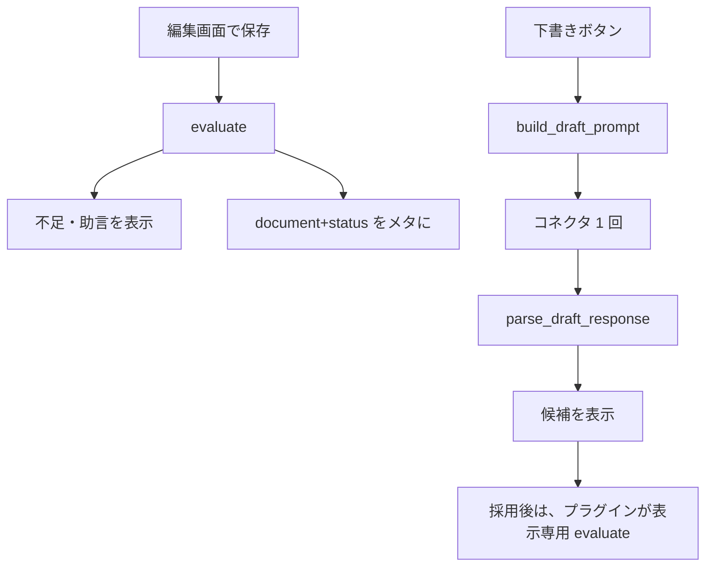

<!--
目的：「使用方法」の明文化
-->

# S2J Webinar Survey Service - 使用方法

本ドキュメントは、呼び出し側 (主に S2J Webinar Survey) が **最小構成で本ライブラリを使う手順** を定義します。

## 設計意図 (ゴール)

内部実装を意識せず、プラグインが評価を呼ぶときと、ボタンの場合だけ下書きを分解できるようにします。タイミングの正本はプラグイン仕様です。

## 非対象

* プラグインのパネル HTML
* `wp_ai_client_prompt` の接続手順
* Zoom 添付

## インストール

```bash
composer require s2j/webinar-survey-service
```

Packagist のパッケージ名だけを require します。`repositories` に `VCS` / `path` は書きません (他の S2J プラグインと同じ)。

## プラグインが評価を呼ぶとき

本ライブラリは呼び出しタイミングを決めません。いつ `evaluate` するかの正本は [S2J Webinar Survey の docs/](https://github.com/stein2nd/s2j-webinar-survey/blob/main/docs/specs.md) です (初版は、明示の投稿更新と表示専用の発火)。

```php
use function S2J\WebinarSurveyService\evaluate;

$result = evaluate( $document, $max_questions );

// $result['document']['status'] が draft | ready
// $result['deficiencies'] / $result['advice'] を適切なメッセージ文にしてパネルに (i18n 経由)
// 助言コードはメタの正本に残さない。表示専用の再計算タイミングはプラグイン仕様
```

`$max_questions` はサイト設定です。未設定ならプラグインが6を渡します。

## 下書きを頼む

```php
use function S2J\WebinarSurveyService\build_draft_prompt;
use function S2J\WebinarSurveyService\parse_draft_response;

$built = build_draft_prompt( 'survey', [
	'event_title'   => $title,
	'document'      => $document,
	'max_questions' => $max_questions,
] );

if ( '' === $built['prompt_text'] || 0 === $built['requested_count'] ) {
	// 上限到達など。送らない
	return;
}

// プラグインがコネクタに 1 回
$response = wp_ai_client_prompt( /* ... */ );

$candidates = parse_draft_response( 'survey', $response, [
	'document'        => $document,
	'requested_count' => $built['requested_count'],
] );
// 人が「この設問を足す」するまで $document に書かない
```

`prompt` / `choices` も同様です。両方に必須の `focus_index` (`int`) と `document` を渡し、件数は `$built['requested_count']` (常に1) を使います。候補への `answer_kind` 等の引き継ぎはライブラリ内です。`survey` では `focus_index` は不要です。

## 処理フロー



採用直後の表示専用 `evaluate` と、メタに書く投稿保存時の `evaluate` の切り分けは、プラグイン仕様です。

## 関連

* PHP API: [php_api_spec.md](./php_api_spec.md)
* プラグイン仕様: [S2J Webinar Survey specs](https://github.com/stein2nd/s2j-webinar-survey/blob/main/docs/specs.md)
