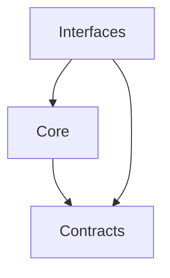

<!--
設計原則
-->

# S2J Webinar Survey Service - 設計原則

## 設計意図 (ゴール)

本プロジェクトの全仕様に共通する、設計ルールを定義します。

## 原則

### 1. Source of Truth

* 規則の正本は、`docs/core/` である。
* 型とフィールドの正本は、`docs/contracts/` である。
* README は、人間向けの最短手順であり、契約と矛盾させない。

### 2. 純関数

* Core は、グローバル状態、時刻、乱数、ネットワーク、ファイルシステムに依存しない。
* 同じ入力には、同じ不足・助言・候補を返す。

### 3. 依存方向

* Core は、WordPress / HTTP / Zoom / モデル SDK を知らない。
* 上限の初期値 (6) やサイト設定の下限・上限 (1〜15) は、ライブラリに埋めない。

### 4. 責務分離

| 層 | 責務 |
| --- | --- |
| Core | 規則 |
| Contracts | 形 |
| Interfaces | 入口 |
| プラグイン | I/O と表示文 |

### 5. 助言は保存を拒まない

* 不足がある場合だけ `draft` である。
* 助言があっても `ready` にできる。
* 誘導と二重問いは、初版では判定しない。

### 6. Zoom を知らない

* 文書の答え方は、`single` / `multiple` / `short` / `long` / `rating` である。
* Zoom の `type` 文字列とリクエストキーは、webinar-service の写像である。

### 7. 下書きは文書に書かない

* 候補は、人が採用するまで、文書に入らない。
* 採用後は、あらためて検査と助言の入力になる。

## 借用する原則 (エコシステム)

[kis-wordpress エコシステム仕様](https://github.com/stein2nd/kis-wordpress/blob/main/docs_mod/specs.md) と同様です。

| 原則 | 本ライブラリでの意味 |
| --- | --- |
| 依存の向きは外 → 内 | 純関数は WP / GatherPress / HTTP / Zoom を知らない |
| 内側はビジネスルール | 検査、助言、依頼文と分解 |
| 外側は詳細 | プラグインが画面、保存、コネクタを持つ |
